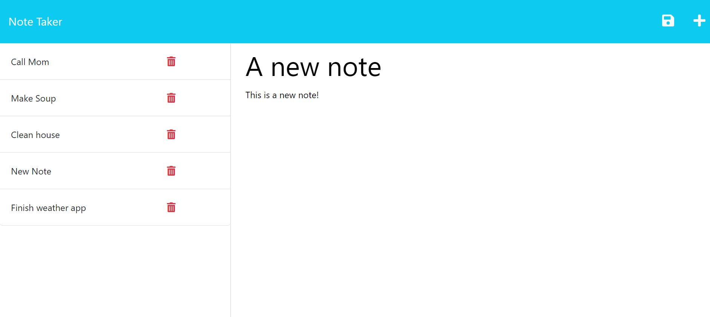

# Express Note Taking App

## Description

This application uses express.js to create a Note Taker that can be used to write and save notes. The application saves and retrieves note data from a JSON file in the back end.

## Table of Contents
- [Installation](#installation)
- [Usage](#usage)
- [Screenshots](#Screenshots)
- [Credits](#credits)
- [Tests](#tests)
- [License](#license)

## Installation
This app is deployed to Heroku.

(https://calm-taiga-62101-01a8971ea8e8.herokuapp.com/notes)

## Usage
When you open the Note Taker, you are presented with a landing page with a link to a notes page. 

When you click on the link to the notes page, you are presented with a page with existing notes listed in the left-hand column, plus empty fields to enter a new note title and the note’s text in the right-hand column. 

When you enter a new note title and note’s text, a Save icon appears in the navigation at the top of the page. When you click on the Save icon - the new note is saved and appears in the left-hand column with the other existing notes.

When you click on an existing note in the list in the left-hand column, the note appears in the right-hand column. When you click on the Write icon in the navigation at the top of the page - you are presented with empty fields to enter a new note title and the note’s text in the right-hand column

## Screenshots

 
 
 

## Credits

## Tests
This app was tested on the back end with Insomnia. All GET and POST requests are working.

## License
N/A

